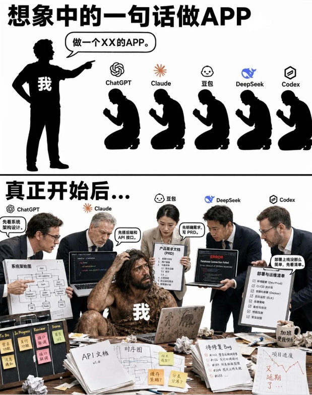
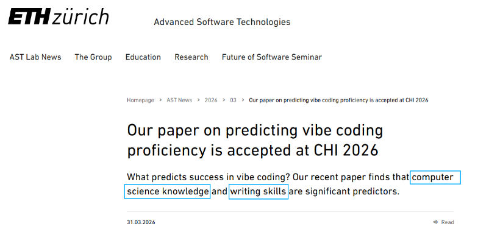

# AI时代最大的骗局：编程没有门槛

> 来源：播妞（黑马程序员）｜整理日期：2026-08-03
> 核心议题：Vibe Coding 时代，编程的「操作门槛」与「隐形门槛」之辨

---

## 一、现象：Vibe Coding 的爽感陷阱

**Vibe Coding** = 只要会跟 AI 聊天，动动嘴代码就出来。

- 上手即巅峰的错觉：「好像编程没门槛了」
- 同样用 ChatGPT / Claude / DeepSeek / Codex：
  - 有人 **半小时** 出完整功能模块，代码规范可复用
  - 有人 **折腾两三天**，反复生成反复改，漏洞百出连 bug 都排查不了
- 工具一样、模型一样，产出天差地别

## 二、核心论点：操作门槛降低 ≠ 隐形门槛消失

### AI 能做的（操作门槛 ↓）
- 搭建环境
- 记 API 拼写
- 排查分号等语法错误
- 机械重复的体力活 → **几秒钟搞定**

### AI 给不了的（隐形门槛仍在）
> 会生成代码 ≠ 会编程

**什么是「内功」（计算机素养 + 工程思维）：**

| 维度 | 具体表现 |
|------|----------|
| 需求拆解 | 看到产品需求，脑子里自动拆解模块 |
| 全栈预判 | 写完前端逻辑，潜意识已预判后端怎么接、并发会不会崩、if 条件有没有安全漏洞 |
| 问题定位 | 系统报错，不看堆栈详情就能猜个七八成，精准锁定嫌疑代码 |

这些能力是在实战项目中反复打磨、在通宵排查中用汗水和教训泡出来的 **肌肉记忆**。

## 三、研究支撑

**苏黎世联邦理工学院（ETH Zürich）AST Lab** 论文被 CHI 2026 接受：

> What predicts success in vibe coding? **Computer science knowledge** and **writing skills** are significant predictors.

翻译：你的底子越厚，AI 在你手里就越强。

## 四、精辟比喻

| 场景 | 普通人 | 专业人士 | 结论 |
|------|--------|----------|------|
| 摄影 | 单反拍得不如手机 | 入门微单照样出大片 | 工具不决定上限 |
| 武侠 | 拿了削铁如泥的宝刀 | 练出一刀毙命的内功 | AI 是刀，你是刀客 |

**结论：AI 能帮你快速起步，但职业天花板由底层认知和解决问题的能力决定。**

---

## 五、个人备注（肖聪）

- 作为 AI 技术专员 + 有实际开发经验的人，这篇戳中痛点
- 自己用 Cursor/Vibe Coding 开发时的体感：有工程基础的人 AI 是倍增器，没有的人 AI 是黑盒
- 对团队 AI 培训有参考价值：推广 AI 辅助编程的同时，不能误导「不需要学基础」
